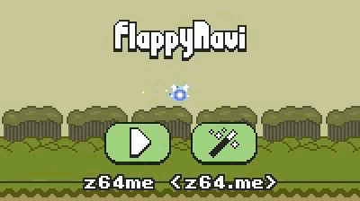

# Flappy Navi

Join Navi the fairy for an adventure across Hyrule!

This is my Zelda-themed Flappy Bird clone. I made it in just three days. [Read my blog post about it](https://z64.me/post/developing-flappy-navi/) if you'd like a glimpse into my creative process.

## Building

Building is as simple as compiling every C source in the `src` directory and linking with `-lSDL2`. As a frequent Linux user, I find [MXE](https://mxe.cc/) convenient because it makes cross-compiling for Windows a breeze. Linux users with `MXE` set up can run `release-win32-static.sh` to build an entirely self-contained executable.

It compiles free of warnings, even with GCC's `-Wextra` flag.

## Attribution

Flappy Navi was made possible by the following open-source libraries:
 - [Simple DirectMedia Layer](https://www.libsdl.org/)
 - [stb_image](https://github.com/nothings/stb)
 - [incbin](https://github.com/graphitemaster/incbin)
 - [rnd](https://github.com/mattiasgustavsson/libs)
 - And many thanks to Master Yoshi for the awesome Navi sprites!

